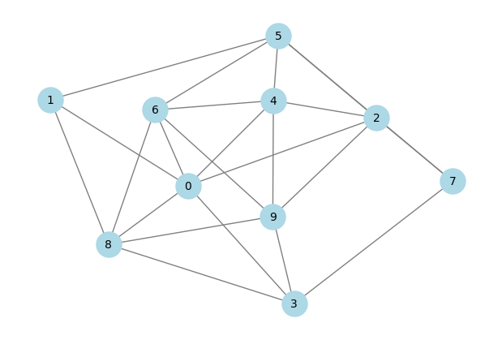

# Dataless

[](https://badge.fury.io/py/your-library)
[](https://opensource.org/licenses/MIT)
[](https://pypi.org/project/dataless/)

Dataless is a python library implementation of the dataless neural network. This concept was introduced by the Alkhouri et.al in [this work](https://arxiv.org/pdf/2203.08209). This concept is mounmental achievement, as the work introduces a way to formulate the NP-hard problems as a differentiable function. 

Formulation of the NP-hard problems in differentiable representation is a big deal, as it allows for gradient based optimizations, or backpropogation in other words. Thus, giving rise to the concept of dataless Neural Network (dNN). The conept of dNN is rigorously expanded by [sangram K. Jena](https://sites.google.com/view/sangramkishorjena/home), in range of his work. Jena provided theoretical background of dNN for range of NP-hard problems. 

In this library, implementation of those problems is also provided.

---

## Overview
The dataless library, takes a graph and solve the graph for a particular NP-hard problem. 

The dataless library expects networkx type graphs, which are either stored in pickle format generated directly on the run time. The neural network uses Adam optimizer with \alpha value of 0.5, combination of which is necessary to avoid the local minima during convergence.  

dNN is converging the f(\theta) using backpropogation, and following equation shows forward pass of the dNN. 

.png)

---

## Getting Started

Dataless library is fairly intuitive. In the first step install the library directly from PyPI:
```bash
pip install dataless
```

Library has a top level dNN object, and can be imported as follows. 
```python
from dataless.dNN import dNN 
```

dNN object the following parameters which can be defined on the runtime.
```bash
dNN(prob_type:str='mdds', graph:nx.Graph=None, use_random:bool=False, nodes:int=None, edges:List[(int, int)]=None, edge_prob:float=0.5)
```
Dataless library right now support dNNs for the following problems. 

| prob_type | Acronym                                |
|-----------|----------------------------------------|
| mdds      | Minimum Disjunctive Dominating Set     |
| mlds      | Minimum Liar's Dominating Set          |
| dissoc    | Dissociation Set                       |
| dom       | Dominating Set                         |
| kcol      | K Coloring                             |
| veds      | Vertex Edge Dominating Set             |

`graph:nx.Graph` expects a graph from the networkx library. It is important to note that if the graph is in the format of a file then first the file must be read and graph should be extracted and then passed into the dNN object.

`use_random:bool` this parameter is used to generate a random gnp graph using the networkx library if set to true. If this parameter is set to true, then `nodes:int` is required. The nodes will be the number of vertices and `edges:List[(int, int)]` is a list of tuples, showing the edges between the vertices. 

`edge_prob:float` is the edge probability which will be used to generate the random graph containing `nodes` vertices. If the `edges` then the generated graph will not be random. 

```python
dnn.solve(params={
    "selection_criteria": 0.5,
    "learning_rate": 0.0001,
    "max_steps": 100000,
    "runtime": False,
    "store_graph": False,
    "theta_init": [],
    "out_dir": 'output'
})
```

`solve()` is the top level method, which will start the training loop of the dNN. the interface of the method also accepts optional `**kwargs`, In the above it is defined as params and has the above default values. 

The training loop of the dNN also the early stopping implemented with the patience of 5, the minima value of the f(\theta) is considered as the metric, if its value does not decreases for 25000 iterations then the dNN training stops, and the code follows with the post-training steps. 

```python
dnn.plot()
```

`plot()` provide a quick way to visualize the graph.


